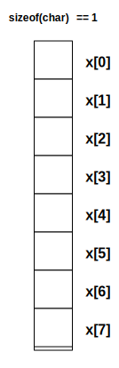
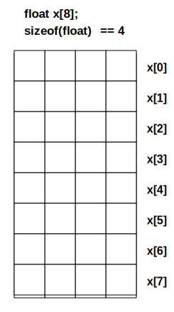
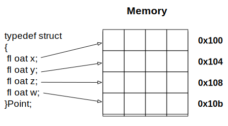
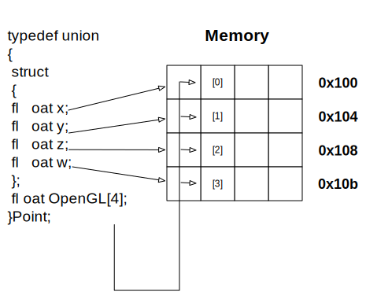

# Basic C++ 11 / 14
Jon Macey

jmacey@bournemouth.ac.uk

---

# C++ 11
- was approved by ISO on 12 August 2011
- Not all compilers support all features
- clang++ 5.0 seems to do a good job as well as g++ 4.8, 
- a good list of features / support [here](https://isocpp.org/wiki/faq/cpp11)
- is now quite common in production

--

# C++ 14 

- Is becoming quite common in most modern compilers
- Not universally taken up in production as yet.
- a good list of features / support [here](https://isocpp.org/wiki/faq/cpp14-language)

--

# C++ 11

- this year we will mainly use C++ 11 (but can use 14 if needed)
- core teaching will focus on C++ 11 features and style
- NGL library is C++ 11
- Most of my demos are C++ 11
- Will occasionally use cool C++ 14 features as illustrations

--

# C++ 11 flags

- to use C++ 11 we need to use compiler flags (some compilers now defauly to c++ 11 but not all)

``` 
clang++ -std=c++11 
g++ -std=c++11  
```

- to use C++ 14 we can use the -std=c++14
- if supported we can use -std=c++1z for C++ 17 features!

---

# namespaces

- namespaces allow us to separate program elements into different named logical units
- By using namespaces we can declare functions, classes and other code that is only visible within the namespace
- The following code shows this in action

--

#  [namespace1.cpp](https://github.com/NCCA/ASELectureCode/blob/master/Lecture2/namespace1.cpp)

```
#include <iostream>
#include <cstdlib>

namespace foo1
{
	void foo()
	{
		std::cout<<"foo1::foo\n";
	}

}

namespace foo2
{
	void foo()
	{
		std::cout<<"foo2::foo\n";
	}

}

namespace foo1
{
  void bar()
  {
    std::cout<<"bar\n";
  }
}


int  main()
{
  foo1::foo();
  foo2::foo();
  foo1::bar();
}
```

--

# [namespace2.cpp](https://github.com/NCCA/ASELectureCode/blob/master/Lecture2/namespace2.cpp)

```
#include <iostream>
#include <cstdlib>

namespace foo1
{
	void foo()
	{
		std::cout<<"foo1::foo\n";
	}

};

namespace foo2
{
	void foo()
	{
		std::cout<<"foo2::foo\n";
	}

};

using namespace foo1;
using namespace foo2;


int  main()
{
  foo();
  foo();
}
```

```
clang11 namespace2.cpp
namespace2.cpp:29:3: error: call to 'foo' is ambiguous
  foo();
  ^~~
namespace2.cpp:6:7: note: candidate function
        void foo()
             ^
namespace2.cpp:15:7: note: candidate function
        void foo()
             ^
namespace2.cpp:30:2: error: call to 'foo' is ambiguous
        foo();
        ^~~
namespace2.cpp:6:7: note: candidate function
        void foo()
             ^
namespace2.cpp:15:7: note: candidate function
        void foo()
             ^
2 errors generated.
```

--

# [namespace3.cpp](https://github.com/NCCA/ASELectureCode/blob/master/Lecture2/namespace3.cpp)


```
#include <iostream>
#include <cstdlib>


void foo()
{
	using std::cout;
	using std::endl;	
	cout<<"foo "<<endl;
}

void bar()
{
	using namespace std;
	cout<<"bar"<<endl;
}

int main()
{
  cout<<"in main\n";
  foo();
  bar();
}
```

```
namespace3.cpp:21:2: error: use of undeclared identifier 'cout'; did you mean
      'std::cout'?
        cout<<"in main\n";
        ^~~~
        std::cout
```

--

# [namespace4.cpp](https://github.com/NCCA/ASELectureCode/blob/master/Lecture2/namespace4.cpp)

```
#include <iostream>
#include <cstdlib>

namespace AReallyLongNamespaceThatIdontWantToType
{

	void foo()
	{
		using std::cout;
		using std::endl;

		cout<<"foo "<<endl;
	}
}

int main()
{
  namespace foo=AReallyLongNamespaceThatIdontWantToType;
  foo::foo();
}
```

--

# namespaces
- It’s good to use namespaces
- makes code more modular
- can embed namespaces within namespaces
- try to use short easy names
- can shorten by re-naming them 
- [or use macro for more complex internal ones](https://github.com/OpenImageIO/oiio/blob/master/src/include/OpenImageIO/oiioversion.h.in)

---

## [sizeof()](https://en.wikipedia.org/wiki/Sizeof)
- In C/C++ sizeof is a unary operator that must be implemented by the developer of the compiler
- it appears as a C/C++ function when we use it but will return the size in bytes of the data type passed to it.
- The following program demonstrates sizeof

--


## [sizeof.c](https://github.com/NCCA/PPPLectureCode/blob/master/Lecture2/sizeof.c)
```c
#include <stdio.h>
#include <stdlib.h>

int main()
{
  printf("sizeof(char)= %ld \n",sizeof(char));
  printf("sizeof(short int)= %ld \n",sizeof(short int));
  printf("sizeof(int)= %ld \n",sizeof(int));
  printf("sizeof(long int)= %ld \n",sizeof(long int));
  printf("sizeof(float)= %ld \n",sizeof(float));
  printf("sizeof(double)= %ld \n",sizeof(double));

  printf("unsigned versions\n");

  printf("sizeof(unsigned char)= %ld \n",sizeof(unsigned char));
  printf("sizeof(unsigned short int)= %ld \n",sizeof(unsigned short int));
  printf("sizeof(unsigned int)= %ld \n",sizeof(unsigned int));
  printf("sizeof(unsigned long int)= %ld \n",sizeof(unsigned long int));

  return EXIT_SUCCESS;
}
```

--

## output 

```
$ clang -Wall -g sizeof.c -o sizeof
$./sizeof
sizeof(char)= 1
sizeof(short int)= 2
sizeof(int)= 4
sizeof(long int)= 8
sizeof(float)= 4
sizeof(double)= 8
unsigned versions
sizeof(unsigned char)= 1
sizeof(unsigned short int)= 2
sizeof(unsigned int)= 4
sizeof(unsigned long int)= 8
```

--

## Why should I worry about size?

- as we shall see many graphics API's work by passing around chunks of raw memory.
- knowing how big our data is will become important when using lower level languages and API's
  - this is true for OpenGL [Buffer Objects](https://www.opengl.org/wiki/Buffer_Object)
  - Cuda [Cuda Memory models](http://www.3dgep.com/cuda-memory-model/)
- and many more.

---


# Arrays

- A Simple data types use a single memory cell block to store a variable.
- It is sometimes more efficient to group data items together in main memory than to allocate an individual memory cell block for each variable.
- A simple way to create different fixed amounts of the of the same data type is by the use of an array.
- An array is a collection of two or more adjacent cells called array elements associated with a specific symbolic name.

--

# Array declaration
```c++
char x[8];
```

- The command above instructs the compiler to allocate 8 memory cells of type char.
- These cells will be contiguous (next to each other in a continuous block)
- This mean accessing them can be done in a sequential manner
- To access the cells we use an index into the cells starting a 0 for the first index. 

--

# Array Access

<div id="mySlideLeft">
<ul>
<li/> To access elements of the array we use the subscript operator [ ]
<li/> This can be used to get or set the array index value.
</ul>
</div>

<div id="mySlideRight">

</div>

--

# float array 

- total allocated memory 8*sizeof(float)=32 Bytes



--


# [Array Initialisation](https://github.com/NCCA/ASELectureCode/blob/master/Lecture2/array.cpp)
- We can initialise an array in a similar way to a normal variable.

```
#include <iostream>
#include <cstdlib>

int main()
{
	// array of vowels
	char vowels[5]={'a','e','i','o','u'};
	// the compiler will fill in how many values (25)
	int primesLT100[]={2,3,5,7,11,13,17,19,23,29,31,
                    37,41,43,47,53,59,61,67,71,73,
                    79,83,89,97};
	// index to our array
	int i;
	// loop and print out the values
	for(i=0; i<5; ++i)
	{
		std::cout<<vowels[i]<<" ";
	}
	// newline
	std::cout<<"\n";

	// as we don't know how big the primes array is we need
	// to figure it out, sizeof will return how big the allocated
	// space is, however it is in bytes and an int takes up
	// sizeof(int) (usually 4) bytes so we need to div by this
	std::cout<<sizeof(primesLT100);
	int sizeOfArray=sizeof(primesLT100)/sizeof(int);
	std::cout<<" size of array "<<sizeOfArray<<"\n";
	// loop and print
	for(i=0; i<sizeOfArray; ++i)
	{
		std::cout<<primesLT100[i]<<" ";
	}
	std::cout<<"\n";
	return EXIT_SUCCESS;
}
```

--

# Problems with Arrays

- one of the main issues with using arrays is we don't know the ammount of elements
- the previous code showed how we can determine the array elements by using

```
int sizeOfArray=sizeof(primesLT100)/sizeof(int);
```
- however this can cause issues with pointers etc [see here](http://stackoverflow.com/questions/4108313/how-do-i-find-the-length-of-an-array)
- to overcome this C++ 11 has std::array

--

# [std::array<T,int size>](http://en.cppreference.com/w/cpp/container/array)

- C++ 11 introduces the std::array this is a c++ version of a normal array
- It allows static allocation of array data, with a set size (on the stack)
- It has the same performance as a normal array but the added advantage that it works like other stl containers (more in a later lecture)

--

# [stdarray.cpp](https://github.com/NCCA/ASELectureCode/blob/master/Lecture2/stdarray.cpp)

```
#include <iostream>
#include <cstdlib>
#include <array>

int main()
{
	std::array<char,5> vowels={'a','e','i','o','u'};
	for(int i=0; i<vowels.size(); ++i)
	{
		std::cout<<vowels[i]<<' ';
	}
	std::cout<<'\n';
	// note use of reference here to mutate
	for( auto &v : vowels)
	{
		v=toupper(v);
	}
	for( auto v : vowels)
	{
		std::cout<<v<<' ';
	}	
	std::cout<<'\n';

}
```

---

#[Type Aliasing](http://en.cppreference.com/w/cpp/language/typedef)

- In C++ (and C for typedef only) we can alias a typename to use a different identifier.
- In C++, any valid type can be aliased so that it can be referred to with a different identifier.

```
typedef [existing type] [new type];
typedef char Byte;
typedef unsigned int WORD;
typedef float Real;
```

--

# [typedef.cpp](https://github.com/NCCA/ASELectureCode/blob/master/Lecture2/typedef.cpp)

```
#include <iostream>
#include <cstdlib>

typedef  char Byte;
typedef  unsigned int Word;
typedef  float Real;

int main()
{
  Byte a='c';
  Word i=10;
  Real x=2.6;
  std::cout<<a<<' '<<i<<' '<<x<<'\n';
  return EXIT_SUCCESS;
}
```

--

# [type aliasing](http://en.cppreference.com/w/cpp/language/type_alias)

- typedef is a C/C++ construct 
- a second syntax to define type aliases was introduced in the C++ 11 language spec

```
#include <iostream>
#include <cstdlib>

using Byte=char;
using Word=unsigned int;
using Real=float;

int main()
{

	Byte a='c';
	Word i=10;
	Real x=2.6;
	std::cout<<a<<' '<<i<<' '<<x<<'\n';
	return EXIT_SUCCESS;
}
```

--

# type aliasing

- internally NGL uses the following ["ngl/Types.h"](https://github.com/NCCA/NGL/blob/master/include/ngl/Types.h)
```
using PRECISION=GLfloat;
using Real=PRECISION;
```
- this allows one line of code in the header to be changed to allow Real to become something else (GLdouble) 

---

# Structures
- The C/C++ struct keyword allows us to create a group of one or more variables, possibly of different types, grouped together under a single name
- We can embed structures within other structures
- and with the use of pointers (more in another lecture) we can make self referential structures.

--

# [struct1.cpp](https://github.com/NCCA/ASELectureCode/blob/master/Lecture2/struct1.cpp)

```
#include <iostream>
#include <cstdlib>

int main()
{
	struct vertex 
	{
	 float x;
	 float y;
	 float z;
	} ;
	struct vertex p1 = { 1.0f, 2.5f, -1.5f};
	struct vertex p2 = p1;
	p2.z=3.0f;
	std::cout<<"Point1 "<<p1.x<<' '<<p1.y<<' '<<p1.z<<'\n';
	std::cout<<"Point2 "<<p2.x<<' '<<p2.y<<' '<<p2.z<<'\n';
	return EXIT_SUCCESS;
}
```


--


# [typedef struct](https://github.com/NCCA/ASELectureCode/blob/master/Lecture2/struct2.cpp)

- We can combine typedef and structs to declare new types.

```
#include <iostream>
#include <cstdlib>

typedef struct
{
  int x;
  int y;
}Point2i;


typedef struct
{
  int r;
  int g;
  int b;
  int a;
}Colour4i;

typedef struct
{
  Point2i p;
  Colour4i c;
}ColourVert;

void debug(const ColourVert &p)
{
  std::cout<<'['<<p.p.x<<','<<p.p.y<< "] ";
  std::cout<<'('<<p.c.r<<','<<p.c.g<<','<<p.c.b<<','<<p.c.a<<")\n";
}


int main()
{
	ColourVert c={{23,10},{255,0,0,0}};
	debug(c);
}
```

--

#[struct3.cpp](https://github.com/NCCA/ASELectureCode/blob/master/Lecture2/struct3.cpp)

- structs can also contain functions, this is the first steps of thinking along the lines of OO and classes

```
#include <iostream>
#include <cstdlib>

  typedef struct
  {
    int x;
    int y;
  }Point2i;


  typedef struct
  {
    int r;
    int g;
    int b;
    int a;
  }Colour4i;

  typedef struct
  {
    Point2i p;
    Colour4i c;
    void debug()
    {
      std::cout<<'['<<p.x<<','<<p.y<< "] ";
      std::cout<<'('<<c.r<<','<<c.g<<','<<c.b<<','<<c.a<<")\n";
    }
  }ColourVert;


int main()
{
  ColourVert c={{23,10},{255,0,0,0}};
  ColourVert d={{99,12},{255,0,255,0}};

  c.debug();
  d.debug();
  return EXIT_SUCCESS;
}
```

---

# [unions](http://en.cppreference.com/w/cpp/language/union) 

- In a structure, the members are allocated in separate consecutive chunks of storage. 



--

# [unions](http://en.cppreference.com/w/cpp/language/union) 

- In a union, every member is allocated the same piece of storage



--

#Why use Unions?

- In the previous example we have declared the individual elements of a vector as x y z & w
- This is good to read and easier than using the array syntax [0]=10 etc
- However as we will see later OpenGL let us use either syntax and there are some advantages (speed) to using the array type syntax.
- Therefore if we define a union of both we have the advantage of both syntax types.

---

#Data structure padding
- Typically the compiler will align data on byte boundaries, however sometimes in structures we will have data with different size requirements
- To maintain proper alignment the translator normally inserts additional unnamed data members so that each member is properly aligned.
- This can cause issues as shown by the following example

--

# example

- given 
```
sizeof(char) == 1 
sizeof(short)==2
``` 
- how big is the following structure?

```
typedef struct
{
	char  identifier;          
	char  colourMapType;      
	char  imageType;         
	short cms;    
	short cml;    
	char  cmb;     
} notPacked;
```

--

# Data Structure Padding

- In the previous example sizeof(notPacked) will return 10 bytes even though the actual size is 8 bytes. 
- This is because the compiler is padding by two bytes to align to a boundary. 
- In most cases this may not be a problem, however if we are writing to disk a set size of data this would cause issues. The same may also be true when writing data to the GPU.
- To overcome this problem in g++ we can use a compiler #pragma as shown in the next slide

--

# [pack.cpp](https://github.com/NCCA/ASELectureCode/blob/master/Lecture2/pack.cpp)

```
#include <iostream>

#pragma pack(push, 1)

typedef struct
{
	char  identifier;         
	char  colourMapType;      
	char  imageType;          
	short cms;     
	short cml;   
	char  cmb;      
} packed;

#pragma pack(pop)

typedef struct
{
	char  identifier;          
	char  colourMapType;      
	char  imageType;         
	short cms;    
	short cml;    
	char  cmb;      
} notPacked;

int main()
{
	std::cout<<"size of char "<<sizeof(char)<<'\n';
	std::cout<<"size of short "<<sizeof(short)<<'\n';
	std::cout<<sizeof(packed)<<'\n';
	std::cout<<sizeof(notPacked)<<'\n';

}
```