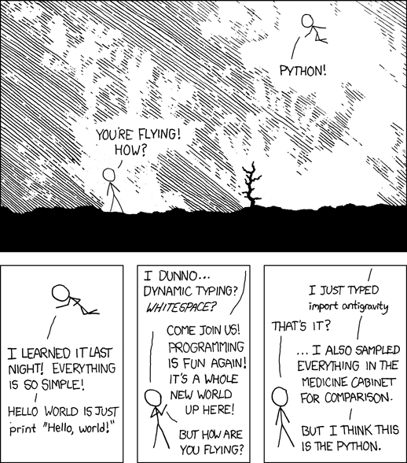
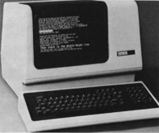
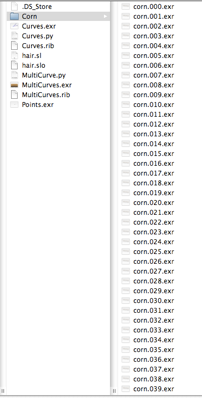
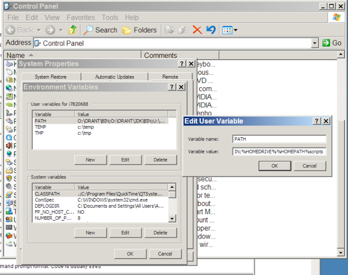
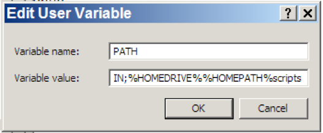
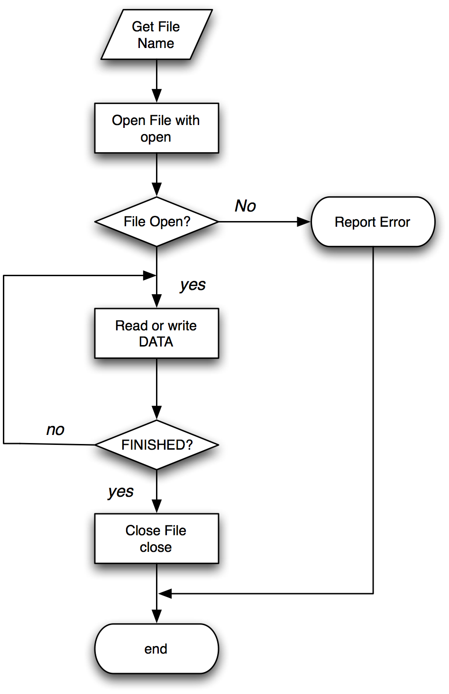

#Introduction to Python
Jon Macey
jmacey@bournemouth.ac.uk

---

## Python
  - python is a very flexible programming language, it can be used in a number of different ways.
  - Most of our animation packages allow for embedded python scripting
  - We can also write complex programs which run stand alone, and if written correctly can run on all operating systems


---


##Hello World

<div class="stretch">
<iframe src="helloWorldPy.html" style="border:0px #FFFFFF solid;" name="code" scrolling="yes" frameborder="1" marginheight="0px" marginwidth="0px" height="100%" width="100%"></iframe>
</div>

--

##import this

<div class="stretch">
<iframe src="importThis.html" style="border:0px #FFFFFF solid;" name="code" scrolling="yes" frameborder="1" marginheight="0px" marginwidth="0px" height="100%" width="100%"></iframe>
</div>

--

## import antigravity


- [python easter eggs](http://digitizor.com/easter-eggs-in-python/)

---

## Lecture Series Outline

- Some basic python commands and techniques
- Interaction with the operating system
- Reading and Writing data to files
- Object Orientation in Python
- Some basic python for the major animation packages 

--

## Getting started
- At it’s simplest level python can be used as a simple command interpreter
- We type python into the console and we get a prompt which lets us enter commands
- If nothing else we can use this as a basic calculator
- It is also useful for trying simple bits of code which we wish to put into a larger system


--

## Keywords

- The following identifiers are keywords in python and must not be used as identifiers
``` python
and       del       from      not       while
as        elif      global    or        with
assert    else      if        pass      yield
break     except    import    print
class     exec      in        raise
continue  finally   is        return
def       for       lambda    try
```

--

## Data Types

- Python is a dynamically typed language, this means that variable values are checked at run-time (sometimes known as “lazy binding”). 
- All variables in Python hold references to objects, and these references are passed to functions by value.
- Python has 5 standard data types
  - numbers, string, list, tuple, dictionary

--

## Numbers

- Python supports four different numerical types:
  - int (signed integers)
  - long (long integers [can also be represented in octal and hexadecimal])
  - float (floating point real values)
  - complex (complex numbers)


--


  ## [numbers](https://github.com/NCCA/DemoPythonCode/blob/master/Basic/numbers.py)

<div class="stretch">
<iframe src="numbers.html" style="border:0px #FFFFFF solid;" name="code" scrolling="yes" frameborder="1" marginheight="0px" marginwidth="0px" height="100%" width="100%"></iframe>
</div>

--

## Strings
 - Python strings are immutable
 - Python allows for either pairs of single or double quotes
 - Subsets of strings can be taken using the slice operator ( [ ] and [ : ] ) with indexes starting at 0 in the beginning of the string and working their way from -1 at the end
 - The plus ( + ) sign is the string concatenation operator, and the asterisk ( * ) is the repetition operator.

--

## [Strings](https://github.com/NCCA/DemoPythonCode/blob/master/Basic/strings.py) 

 <div class="stretch">
<iframe src="strings.html" style="border:0px #FFFFFF solid;" name="code" scrolling="yes" frameborder="1" marginheight="0px" marginwidth="0px" height="100%" width="100%"></iframe>
</div>

--

## Lists

  - A list is the most common of the Python data containers / types. 
  - It can hold mixed data, include lists of lists
  - A list is contained within the [] brackets and is analogous to C arrays
  - Like a string data is accessed using the slice operator ( [ ] and [ : ] ) with indexes starting at 0 in the beginning of the list and working their way to end-1.
  - The + operator concatenates and the * duplicates

--

## [Lists](https://github.com/NCCA/DemoPythonCode/blob/master/Basic/list.py)

<div class="stretch">
<iframe src="lists.html" style="border:0px #FFFFFF solid;" name="code" scrolling="yes" frameborder="1" marginheight="0px" marginwidth="0px" height="100%" width="100%"></iframe>
</div>

--

## Tuples
- A tuple can be thought of as a read only list.
- it uses parenthesis to contain the list data

--

## [Tuples](https://github.com/NCCA/DemoPythonCode/blob/master/Basic/tuple.py)
<div class="stretch">
<iframe src="tuple.html" style="border:0px #FFFFFF solid;" name="code" scrolling="yes" frameborder="1" marginheight="0px" marginwidth="0px" height="100%" width="100%"></iframe>
</div>

--

## [Slice Operators](https://github.com/NCCA/DemoPythonCode/blob/master/Basic/slice.py)
<div class="stretch">
<iframe src="slice.html" style="border:0px #FFFFFF solid;" name="code" scrolling="yes" frameborder="1" marginheight="0px" marginwidth="0px" height="100%" width="100%"></iframe>
</div>

--

## Python Dictionaries

- Python dictionaries are a powerful key / value data structure which allows the storing of different data types in the same data set
- It is similar to an associative array or hash map in other programming languages
- Many Python API’s use dictionaries to store values and variable length function parameters

--

## [Python Dictionaries](https://github.com/NCCA/DemoPythonCode/blob/master/Basic/dictionary.py)
<div class="stretch">
<iframe src="dictionary.html" style="border:0px #FFFFFF solid;" name="code" scrolling="yes" frameborder="1" marginheight="0px" marginwidth="0px" height="100%" width="100%"></iframe>
</div>

--

## Type Conversion
- Python allows type conversion via a number of functions, the most common are

| Function                | Description                                                          |
|-------------------------|----------------------------------------------------------------------|
| ```int(x ,base)```      | Converts x to an integer. base specifies the base if x is a string   |
| ```long(x,base)```      | Converts x to an long int. base specifies the base if x is a string. |
| ```float(x)```          | Converts x to an float.                                              |
| ```complex(real,img)``` | Generate a complex number                                            |
| ```str(x)```            | Converts x to a string representation                                |

--

## [Type Conversion](https://github.com/NCCA/DemoPythonCode/blob/master/Basic/convert.py)

<div class="stretch">
<iframe src="convert.html" style="border:0px #FFFFFF solid;" name="code" scrolling="yes" frameborder="1" marginheight="0px" marginwidth="0px" height="100%" width="100%"></iframe>
</div>

--

## Python Membership Operators
- There are two membership operators in python “in” and “not in”
- These can be used to test for membership in lists, tuples and strings

--

## [Membership](https://github.com/NCCA/DemoPythonCode/blob/master/Basic/membership.py)

<div class="stretch">
<iframe src="membership.html" style="border:0px #FFFFFF solid;" name="code" scrolling="yes" frameborder="1" marginheight="0px" marginwidth="0px" height="100%" width="100%"></iframe>
</div>

---

## Programming Constructs

- Most programming tasks can be split into a combination of the following elements
  - Sequences
  - Selection
  - Iteration
- Whenever I learn a new language I see how these are represented syntactically as this makes learning the language easier.

--

## Sequences
- As the name suggest a sequence is a fixed set of instructions 
- They are always carried out in the same order
- With the use of functions we can bundle other sequences together to make programs easier to read / maintain
- The following example shows this in action

--

## [Sequences](https://github.com/NCCA/DemoPythonCode/blob/master/Basic/sequence.py)

<div class="stretch">
<iframe src="sequence.html" style="border:0px #FFFFFF solid;" name="code" scrolling="yes" frameborder="1" marginheight="0px" marginwidth="0px" height="100%" width="100%"></iframe>
</div>

--

## [Sequences](https://github.com/NCCA/DemoPythonCode/blob/master/Basic/sequence2.py)

<div class="stretch">
<iframe src="sequence2.html" style="border:0px #FFFFFF solid;" name="code" scrolling="yes" frameborder="1" marginheight="0px" marginwidth="0px" height="100%" width="100%"></iframe>
</div>

--

## Python functions
- In python functions are actually values, this means we can pass functions around like variables
- Python functions also allow for multiple return types (unlike C/C++) this means there is no pass by value / reference type constructs
- Functions are declared using the def keyword and uses the : to indicate the body of the function which must be indented

--

## [function demo 1](https://github.com/NCCA/DemoPythonCode/blob/master/Basic/func1.py)
<div class="stretch">
<iframe src="function1.html" style="border:0px #FFFFFF solid;" name="code" scrolling="yes" frameborder="1" marginheight="0px" marginwidth="0px" height="100%" width="100%"></iframe>
</div>

--

## [function demo 2](https://github.com/NCCA/DemoPythonCode/blob/master/Basic/func2.py)
<div class="stretch">
<iframe src="function2.html" style="border:0px #FFFFFF solid;" name="code" scrolling="yes" frameborder="1" marginheight="0px" marginwidth="0px" height="100%" width="100%"></iframe>
</div>

--

## Selection
- selections allow us to make choices
- most programming languages have at least the if else construct
- some languages have more
- The result of an if operation is a boolean (true / false) value and code is executed or not depending upon these value
- In python we use the following constructs

--

## [Selection](https://github.com/NCCA/DemoPythonCode/blob/master/Basic/selection.py)
<div class="stretch">
<iframe src="selection.html" style="border:0px #FFFFFF solid;" name="code" scrolling="yes" frameborder="1" marginheight="0px" marginwidth="0px" height="100%" width="100%"></iframe>
</div>

--

## Python Comparison Operators
<small>given ```a=10 b=20```</small>

| <small>Operators    </small>              | <small>Description               </small>                                                                 | <small>Example  </small>          |
|----------------------------|--------------------------------------------------------------------------------------------|--------------------|
| <small>```==```    </small>                | <small>equality operator returns true if values are the same </small>                                     | <small>(a==b) is not true  </small>|
| <small>```!=```  </small>                  | <small>not equal operator             </small>                                                            | <small>(a!=b) is true   </small>   |
| <small>```<>``` (now obsolescent)  </small>| <small>Checks if the value of two operands are equal or not   </small>                                    | <small>(a<>b) is true   </small>   |
| <small>```>```    </small>                 | <small>Checks if the value of left operand is greater than the value of right operand  </small>           |  <small>(a>b) is not true  </small> |
| <small>```<```    </small>                 |  <small>Checks if the value of left operand is less than the value of right operand   </small>              |  <small>(a>b) is true     </small>  |
| <small>```>=```    </small>                |  <small>Checks if the value of left operand is greater than or equal to the value of right operand  </small>| <small> (a>=b) is not true </small> |
| <small>```<=```    </small>                |  <small>Checks if the value of left operand is less than or equal to the value of right operand   </small>  | <small> (a<=) is true   </small>    |

--

## Python Logical Operators

<small>given ```a=10 b=20```</small>

| <small>Operators    </small>              | <small>Description               </small>                                                                 | <small>Example  </small>          |
|----------------------------|--------------------------------------------------------------------------------------------|--------------------|
| <small>```and```    </small>                | <small>Logical and </small>                                     | <small>a and b is true  </small>|
| <small>```or```  </small>                  | <small>Logical or             </small>                                                            | <small>a or b is true   </small>   |
| <small>```not``` (now obsolescent)  </small>| <small>Logical not   </small>                                    | <small>not (a and b) is false  </small>   |

--

## Selection

- selections can be embedded to create quite complex hierarchies of “questions”
- This can sometimes make reading code and maintenance hard especially with the python white space rules as code quite quickly becomes complex to read
- We usually prefer to put complex sequences in functions to make the code easier to read / maintain

--

## iteration

- iteration is the ability to repeat sections of code 
- python has two main looping constructs 
  - for each
 - while
- for-each loops operate on ranges of data 
- while loops repeat while a condition is met

--

## [iteration](https://github.com/NCCA/DemoPythonCode/blob/master/Basic/iteration1.py)
<div class="stretch">
<iframe src="iteration1.html" style="border:0px #FFFFFF solid;" name="code" scrolling="yes" frameborder="1" marginheight="0px" marginwidth="0px" height="100%" width="100%"></iframe>
</div>

--

## [iteration](https://github.com/NCCA/DemoPythonCode/blob/master/Basic/iteration.py)
<div class="stretch">
<iframe src="iteration2.html" style="border:0px #FFFFFF solid;" name="code" scrolling="yes" frameborder="1" marginheight="0px" marginwidth="0px" height="100%" width="100%"></iframe>
</div>

--

## Recursion
- Recursion occurs when a thing is defined in terms of itself or of its type
- in programming this usually done by defining a function and call the same function within itself
- obviously we will need some way of escaping this else it will go on forever
- We use this quite a lot in graphics to traverse hierarchies.  

--


## [Recursion](https://github.com/NCCA/DemoPythonCode/blob/master/Basic/recursion.py)
<div class="stretch">
<iframe src="recursion.html" style="border:0px #FFFFFF solid;" name="code" scrolling="yes" frameborder="1" marginheight="0px" marginwidth="0px" height="100%" width="100%"></iframe>
</div>

--

## looping for x and y

- This example shows how we can loop from -10 in the x and y in increments of 0.5
- In C / C++ we would use a for loop
```c++
for(float y=-10.0f; y<10.0f; ++y)
{
    for(float x=-10.0f; x<10.0f; ++x)
    {
      std::cout<<x<<' '<<y<<'\n';
    }
}
```

--

## [looping for x and y](https://github.com/NCCA/DemoPythonCode/blob/master/Basic/floatLoop.py)

<div class="stretch">
<iframe src="floatLoop.html" style="border:0px #FFFFFF solid;" name="code" scrolling="yes" frameborder="1" marginheight="0px" marginwidth="0px" height="100%" width="100%"></iframe>
</div>

--

## [A 'pythonic' loop](https://github.com/NCCA/DemoPythonCode/blob/master/Basic/Loop2.py)

<div class="stretch">
<iframe src="altloop.html" style="border:0px #FFFFFF solid;" name="code" scrolling="yes" frameborder="1" marginheight="0px" marginwidth="0px" height="100%" width="100%"></iframe>
</div>

---

## Built In Functions
<div class="stretch">
<iframe src="https://docs.python.org/2/library/functions.html" style="border:0px #FFFFFF solid;" name="code" scrolling="yes" frameborder="1" marginheight="0px" marginwidth="0px" height="100%" width="100%"></iframe>
</div>

--

## [enumerate](https://github.com/NCCA/DemoPythonCode/blob/master/Basic/enumerate.py)

<div class="stretch">
<iframe src="enumerate.html" style="border:0px #FFFFFF solid;" name="code" scrolling="yes" frameborder="1" marginheight="0px" marginwidth="0px" height="100%" width="100%"></iframe>
</div>

--

## set / frozenset

- A set object is an unordered collection of immutable values. 
- Common uses include membership testing, removing duplicates from a sequence, and computing mathematical operations such as intersection, union, difference, and symmetric difference. 
- sets may be added to, frozen sets may not, however both types may be compared against each other

--

## [set / frozenset](https://github.com/NCCA/DemoPythonCode/blob/master/Basic/set.py)
<div class="stretch">
<small>this doesn't work fully on this system best to run in the shell</small>
<iframe src="set.html" style="border:0px #FFFFFF solid;" name="code" scrolling="yes" frameborder="1" marginheight="0px" marginwidth="0px" height="100%" width="100%"></iframe>
</div>

--

## [lambda](https://github.com/NCCA/DemoPythonCode/blob/master/Basic/lambda.py)
<div class="stretch">

<iframe src="lambda.html" style="border:0px #FFFFFF solid;" name="code" scrolling="yes" frameborder="1" marginheight="0px" marginwidth="0px" height="100%" width="100%"></iframe>
</div>

---

## Programming
- There are many more constructs and techniques we need to apply to create complex programs
- but for now the basic techniques illustrated will be used in most of our code
- For the rest of the lecture we are going to look at how we can execute our own scripts within the different Operating systems we use

--

## A trip back in time

- Early electronic computing (pre 80’s) didn’t have the GUIs we have today.
- This meant that all interactions with the computer were done with typing into a terminal.
- Most modern operating systems still have the option to do this
- In some cases this method is quicker than using the GUI (but does require some additional knowledge)

--

## Example

<div id="mySlideLeft" widht=60%>

</div>    
<div id="mySlideRight" width=80%><small>
  <p data-markdown> - If we wish to rename every file in the tree opposite in a GUI we would have to click on every file and type the new name </p>
  <p data-markdown> - Some Operating Systems allow the automation of GUI tasks but this is still time consuming. </p>
  <p data-markdown> - The answer in most cases is to use another GUI program or to write a script </p>
  <p data-markdown> - Most scripting languages let us access the underlying os commands to do this </p>
</small>
</div>

--

## The Shell
- In windows we can access the command prompt (shell) by typing cmd in the start menu
- In linux we can open a shell by clicking on the shell icon (but if you a real linux user there will be one open all the time!)
- We can then start typing commands, however windows and Unix have different commands for the same action

--

## Shell Commands

| <small/>Command's Purpose                                         | <small/>MS-DOS      | <small/>Linux       | <small/>Basic Linux Example                  |
|-----------------------------------------------------------|-------------|-------------|--------------------------------------|
|<small/> Copies files                                              |<small/> copy        |<small/> cp          |<small/> cp thisfile.txt /home/thisdirectory  |
|<small/> Moves files                                               |<small/> move        |<small/> mv          |<small/> mv thisfile.txt /home/thisdirectory  |
|<small/> List files                                                |<small/> dir         |<small/> ls          |<small/> ls                                   |
|<small/> Clears screen                                             |<small/> cls         |<small/> cls         |<small/> clear                                |
|<small/> Deletes files                                             |<small/> del         |<small/> rm          |<small/> rm thisFile.txt                      |
|<small/> Finds a string of text in a file                          |<small/> find        |<small/> grep        |<small/> grep ImageName *.txt                 |
|<small/> Creates a directory                                       |<small/> mkdir       |<small/> mkdir       |<small/> mkdir images                         |

--

## Shell Commands

| <small/>Command's Purpose                                         | <small/>MS-DOS      | <small/>Linux       | <small/>Basic Linux Example                  |
|-----------------------------------------------------------|-------------|-------------|--------------------------------------|
|<small/> View a file (in shell)                                    |<small/> more        |<small/> less        |<small/> more text.txt (can use less as well) |
|<small/> Renames a file                                            |<small/> ren         |<small/> mv          |<small/> mv this.txt that.txt                 |
|<small/> Displays your location in the file system                 |<small/> chdir       |<small/> pwd         |<small/> pwd                                  |
|<small/> Changes directories with a specified path (absolute path) |<small/> cd pathname |<small/> cd pathname |<small/> cd /directory/directory              |
|<small/> Changes directories with a relative path                  |<small/> cd ..       |<small/> cd ..       |<small/> cd ../images/                        |


--

## Environment Variables
- When we open a shell we are placed in our home directory 
- This place is stored in an Environment variable called
  - $HOME on unix and mac
  - %HOMEPATH% on windows

```bash
echo $HOME
echo %HOMEPATH%

/Users/jmacey
\Users\jmacey
```

--

## Environment Variables
- Environment variables are global system variables available to all processes (i.e. programs)
- Most operating systems have a number of default values set which programs can query to set the way things operate.
- Users can also se their own environment variables to customise how things work.
- It is not uncommon for software packages to install their own environment variables when the program is installed.

--

## Environment Variables
- The PATH environment variable allows us to set a directory where the OS will look for scripts and programs
- We can add a local directory to our system which contains user scripts which can be executed by the user
- The configuration is different for both Windows and Unix

--

## Unix Environment variables

- The default shell used in the linux studios is the bash shell (Bourne again Shell)
- To set environment variable in this shell we use a file called .bashrc which is hidden in the home directory
- if you type gedit ~/.bashrc you can access it 

```bash
export PATH=$PATH:$HOME/scripts
```
- if you re-open the shell this will be made permanent
- Now any program placed in this directory may be found and executed

--

## Windows Environment Variables

- Setting environment variables in windows is different from Unix as we have to use the GUI
- In our studios we can access them from the control panel and students have admin rights to do so
- The following panels show the way to do this

--

## Windows Environment Variables

<div id="mySlideLeft"   >

</div>    
<div id="mySlideRight">
  <p data-markdown> - Select the system variable called Path </p>
  <p data-markdown> - Click on the edit button and the following dialog will be displayed </p>
</div>


--

## Windows Environment Variables


- At the end of the Variable value line add the following

``` bash
;%HOMEDRIVE%%HOMEPATH%scripts
```

- The ; is a separator for the different values

--

## The scripts directory

- Now we have told the system to look in the scripts directory for any scripts to run we need to create this directory
- To do this in the console we do the following where the mkdir command makes a directory

```bash
// Windows
cd %HOMEPATH%
mkdir scripts

// linux
cd
mkdir scripts
```

--

## testing

```python
#!/usr/bin/python

print 'this is working'
```

- Type the above in an editor (or your choice) and save it in the scripts directory as hello.py
- In unix issue the following command in the same directory

```bash
chmod 777 hello.py
```

- now from any directory you should be able to type hello.py to run the script 

--

## [os.environment](https://github.com/NCCA/DemoPythonCode/blob/master/Basic/env.py)

- These need to be run on a machine and not online 

``` python
#!/usr/bin/python
import os

for env in os.environ :
	print "Variable = %s \nValue = %s"%(env, os.environ.get(env))
```

``` python
#!/usr/bin/python
import os

if ( os.environ.get("PROJECTDIR") == "/tmp") :
	print "project ok"
else :
	print "project not ok"
```

--


## The main function

- The main function is a special function for most programming languages 
- It is the first function to be executed and is the entry point for most programs
- The main function is usually passed a set of global system variables called arguments
- These are available through the life of the program and are a good way of passing values to a program

--


## Python main


``` python
#!/usr/bin/python
import sys

def foo(argv=None):
	print "in foo function"
	print "my name is ",__name__


if __name__ == "__main__":
    sys.exit(foo())

```

```python
#!/usr/bin/python
import sys
import foo

def main(argv=None):
	print "in main function"
	print __name__
	foo.foo()


if __name__ == "__main__":
    sys.exit(main())
```

--

## Command Line arguments

- When a program is executed form the command line the whole line typed is passed to the program using the variable argv
- argv is a text string array split based on white space
- The following program show how we can print these values out

--


## [arguments](https://github.com/NCCA/DemoPythonCode/blob/master/Basic/arg.py)

``` python
#!/usr/bin/python
import sys

def main(argv=None):
	if argv is None:
		argv = sys.argv
	for args in argv :
		print args


if __name__ == "__main__":
    sys.exit(main())

```

``` bash
./arg.py hello this is a command line -f -a 1 2 3
hello 
this 
is 
a 
command 
line 
-f 
-a 
1 
2 
3

```

--

## getopt
- The getopt function is used to process a list of arguments in the form 
- -l or -vfx will be split into -v -f -x
- -f [optional argument]
- --help (know as a long option)
- The programmer passes a list of these options and the getopt function will split them (any additional command line values will be ignored)


--

## [getopt](https://github.com/NCCA/DemoPythonCode/blob/master/Basic/getopts.py)

```python

#!/usr/bin/python


import  getopt, sys

def usage() :
	print "to use the program pass -l for long mode"
	print "-f [name] for file mode"

class Usage(Exception):
    def __init__(self, msg):
        self.msg = msg
        print "Unknown Option\n\n"
        usage()

def main(argv=None):
	if argv is None:
		argv = sys.argv
	# process the command line options
	try:
		try:
			opts, args = getopt.getopt(argv[1:], "hlf:s", ["help","long","file=","short"])
		except getopt.error, msg:
			raise Usage(msg)
    	except Usage, err:
			print >>sys.stderr, err.msg
			print >>sys.stderr, "for help use --help"
			return 2

	for opt, arg in opts:
		if opt in ("-l", "--long"):
			print "long mode"
		elif opt in ("-h","--help") :
			usage()
			return
		elif opt in ("-f","--file") :
			print "File Mode name passed ",arg
		elif opt in ("-s","--short") :
			print "short"
	print "Now in Main Program"

if __name__ == "__main__":
    sys.exit(main())
```

--

## The string data type
- Python has a built in string data type which allows us to manipulate text
- Python has the ability to handle both ASCII and Unicode string. 
- For all the examples we are going to work with we will be using only ASCII strings
- The following example shows some basic string manipulation

--

## [demo](https://github.com/NCCA/DemoPythonCode/blob/master/Basic/String1.py)

<div class="stretch">

<iframe src="exr.html" style="border:0px #FFFFFF solid;" name="code" scrolling="yes" frameborder="1" marginheight="0px" marginwidth="0px" height="100%" width="100%"></iframe>
</div>

--

## Format Specifiers
- In the previous example we used the % format specifier to add to a text string the numeric value for the length.
- This is similar to the C syntax for printing values.
- The table on the next page shows the available specifiers 

--

## Format Specifiers

|<small/>Format String	|<small/>Meaning	                                | <small/>Data Type       |
|---------------|-----------------------------------------|-----------------|
|<small/> ```%d``` 	          | <small/>Integer Decimal	                        | <small/>int             |
| <small/>```%o```            | <small/>Octal Decimal	                          | <small/>int             |
|<small/> ```%x```	          | <small/>Hexadecimal 	                          | <small/>int             |
|<small/> ```%f	```           | <small/>Floating Point (Decimal Notation)	      | <small/>float           |
| <small/>```%e``` 	          | <small/>Floating Point (1.E notation)	          | <small/>float           |
| <small/>```%c```            | <small/>First Character or argument is printed	| <small/>char            |
|<small/> ```%s```	          | <small/>Argument is taken to be a string	      | <small/>string          |
|<small/> ```%r```	          | <small/>convert argument to python object	      | <small/>any python type |

--

## [format](https://github.com/NCCA/DemoPythonCode/blob/master/Basic/FormatString.py)

<div class="stretch">

<iframe src="format.html" style="border:0px #FFFFFF solid;" name="code" scrolling="yes" frameborder="1" marginheight="0px" marginwidth="0px" height="100%" width="100%"></iframe>
</div>

--

## Accessing the Filesystem
- The python [os module](https://docs.python.org/2/library/os.html#module-os) contains a number of functions which allow us to access the file system
- This module allows us to create files and directories
- Change directories
- List the contents of a directory
- and much more 

--

## [Accessing the filesystem](https://github.com/NCCA/DemoPythonCode/blob/master/Basic/OS.py)

```python
#!/usr/bin/python

import os
# get our current directory
CWD = os.getcwd()
print CWD
# make a directory
os.mkdir("TestDir")
# change to the new directory
os.chdir("TestDir")
NewDir = os.getcwd()
print NewDir
print os.listdir(CWD)
# change back to CWD 
os.chdir(CWD)
# remove the dir we made
os.rmdir("TestDir")
print os.listdir(CWD)
```

--

## Listing Files in a directory

- The os.listdir() function will return a list of all the files in the current directory
- If we need to identify only a certain type of file we need search the string for the type we are looking for
- The following example identifies only exr files based on the .exr extension

--

## [os.listdir()](https://github.com/NCCA/DemoPythonCode/blob/master/Basic/ListEXR.py)

```python
#!/usr/bin/python

import os

Files=os.listdir(".")

for file in Files :
	if file.endswith(".exr") :
		print file
```

--

## [Rename.py](https://github.com/NCCA/DemoPythonCode/blob/master/Basic/Rename.py)
- The following script uses the previous examples to search for files in the current directory beginning with “name”
- It will then rename the files with the name passed in with the 2nd argument

--

## [Rename.py](https://github.com/NCCA/DemoPythonCode/blob/master/Basic/Rename.py)

```python
#!/usr/bin/python

import os
import shutil
import sys

def Usage() :
	print "Rename OldName NewName"

def main(argv=None):
# check to see if we have enough arguments
	if len(sys.argv) !=3 :
		Usage()
	else :
		# get the old and new file names
		OldName=sys.argv[1]
		NewName=sys.argv[2]
		# get the files in the current directory
		Files=os.listdir(".")
		# for each file
		for file in Files :
			# see if it starts with the old name
			if file.startswith(OldName) :
				# make a copy of the old file name
				oldfile=file;
				# now we break down the string so we can
				# build the new file name
				file=file.split(".")
				file[0]=NewName
				file="%s.%s.%s" %(file[0],file[1],file[2])
				# finally we rename the file (using move)
				shutil.move(oldfile,file)


if __name__ == "__main__":
    sys.exit(main())
```

--

## [shutil](https://docs.python.org/2/library/shutil.html#module-shutil)
- The shutil module offers a number of high-level operations on files and collections of files.
- As different operating systems use different commands this is a good way of doing operating system independent operations
- This allows us to write scripts which will work on all operating systems

--

##  A More Advanced example

- The following example allows us to reformat files structured like Name.xxx.ext
- It has the option to resize the padding .xxx. values to any user specified length (default 4)
- To filter file names so only certain files are converted
- To rename the file as part of the conversion

--

## [repad.py](https://github.com/NCCA/DemoPythonCode/blob/master/Basic/repad.py)

```python
#!/usr/bin/python
from os import *
from os.path import *
import shutil

import os, commands, getopt, sys

def usage() :
	print "**************************************************************************"
	print "repad.py re-number file sequences"
	print "Version 1.0 by jmacey@bmth.ac.uk"
	print "**************************************************************************"
	print "At present it only works for files of the format Name.###.ext\n"
	print "The script will process all files it finds in the current directory "
	print "If only certain files are to be processed use the -f Filter Option"
	print "\nOptions :\n"
	print "-p --pad set the pad level e.g. -p 9 will give the output Example.000000001.tiff"
	print "-f --filter [\"filter\"] only process files containing the text \"filter\""
	print "-r --rename [\"new name\"] rename the file as well\n"
	print "\nThis works on the whole file name so for example :\n"
	print "repad.py -p 5 -f tiff would search for all tiff files"
	print "repad.py -p 6 -f AOPass would search for files containing the text AOPass\""
	print "\n-h --help print this help\n"

class Usage(Exception):
    def __init__(self, msg):
        self.msg = msg
        print "Unknown Option"
        usage()

def main(argv=None):
	if argv is None:
		argv = sys.argv
	# process the command line options
	try:
		try:
			opts, args = getopt.getopt(argv[1:], "hp:f:r:", ["help","pad=","filter=","rename="])
		except getopt.error, msg:
			raise Usage(msg)
    	except Usage, err:
			print >>sys.stderr, err.msg
			print >>sys.stderr, "for help use --help"
			return 2
	# default file pad is 4 i.e. .0001.
	PAD=4
	# by default try and process all files in the directory
	FILTER=False
	# by default dont rename the file as well
	RENAME=False
	RenameString=[]
	# the string to contain the filter text
	FiltString=[]
	for opt, arg in opts:
		# set the padding value converting from the command line string to an int
		if opt in ("-p", "--pad"):
			PAD=int(arg)
		elif opt in ("-h","--help") :
			usage()
			return
		# find the filter string
		elif opt in ("-f","--filter") :
			FILTER=True
			FiltString=arg
		elif opt in ("-r","--rename") :
			RENAME=True
			RenameString=arg


	# ok this is cool (try doing it in C++) we create a string containing our format specifier
	# i.e. %09d (using PAD as the variable to specify the numeric value)
	# this is then used later to pass the value we want for the number of the file
	# this works as Python evaluates as it goes (interprets) the string, also note to use a % in the
	# string we need to use %% (a la C)

	str="%%0%dd" %(PAD)
	# get all the files in the current directory
	FileNames=listdir(".")
	# now loop through all the files
	ConvCount=0
	for Files in FileNames :
		# split the file name into sections
		name=Files.split(".")
		# if filter option has been set see if it is in the string
		if(FILTER== True) :
			if(Files.rfind(FiltString) == -1) :
				continue

		# if we have 3 elements to the filename (not the best check as it could be wrong)
		if len(name) ==3 :
			if(RENAME == True) :
				name[0]=RenameString
			#build the new file name with the padding
			outputname=name[0]+"."+str %(int(name[1]))+"."+name[2]
			# this should be portable over different os's but it basically calls the move / mv command
			# to copy the file to the new name
			shutil.move(Files,outputname)
			ConvCount+=1
	print "Files Converted ",ConvCount


if __name__ == "__main__":
    sys.exit(main())


```

---

## Files
- One of the simplest way of communicating between different packages and different programs is by the use of text files.
- Reading and writing files in python is very simple and allows us to very quickly output elements from one software package to another in an easily readable hence debuggable way.

--

## Files



--

## Stream I/O

- When a file is opened a file descriptor is returned and this file descriptor is used for each subsequent I/O operation, when any operation is carried out on the file descriptor its is known as a stream.
- When a stream is opened the stream object created is used for all subsequent file operations not the file name.

--

## [The open function](https://docs.python.org/2/library/functions.html#open)

```python
# open a file for reading
FILE=open('test.txt','r')

# open a file for writing
FILE=open('text.txt',''w')
```
- The open function takes two parameters
  - The fist is a String for the name of the file to open
  - The 2nd  is the open mode 'r' for reading from a file 'w' for writing to a file
